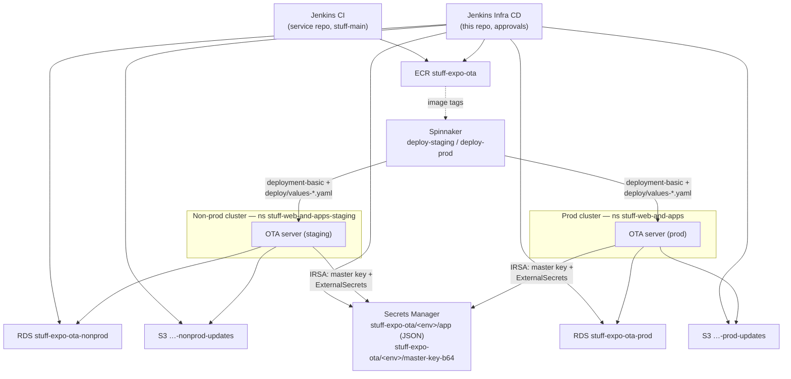

# stuff-expo-ota — deployment plan

The OTA update server is treated as a first-class Stuff service (like
`stuff-ai-service`): CI in the service repo, Spinnaker deploys, and a
dedicated infra pipeline underneath. Two environments — **staging** and
**prod** — in the same namespaces ai-service uses.

The service repo is `StuffNZ/expo-open-ota`, branch **`stuff-main`** — the
temporal master (upstream PR #65 control-plane + our 13 review fixes +
integration suite) until that work merges upstream. When it does, `stuff-main`
rebases onto the upstream release and eventually dissolves.

## The three pipelines

| Pipeline | Where | Does |
|---|---|---|
| **CI** | `pipelines/Jenkinsfile.ci` (this repo, `stuff-main`) | build, vet, test every branch/PR; on `stuff-main` pushes the image to ECR `stuff-expo-ota:<sha>` |
| **Infra CD** | `pipelines/Jenkinsfile.infra.cd` (this repo, Jenkins, approval-gated) | terraform in `infrastructure/`: every run plans shared (ECR, shared-services account) **and** the chosen `nonprod`/`prod` env stack (S3, RDS, IRSA, secrets in the nebula accounts); one approval applies both |
| **Deploy** | `stuff-nebula-devops-tools/spinnaker/applications/stuff-expo-ota` | standard `helmPipelines`: deploy-staging, deploy-prod, rollback-prod — `deployment-basic@1.2.1` from Nexus, values from this repo's `deploy/` dir |

## Architecture

## How configuration flows

- **Plain config** → `deploy/values*.yaml` in the service repo (`env:` block).
- **Secrets** → one JSON secret per environment (`stuff-expo-ota/<env>/app`
  with `DB_URL` / `ADMIN_PASSWORD` / `JWT_SECRET` properties, assembled by
  terraform). The deployment-basic chart's ExternalSecrets machinery
  (`externalSecrets.properties`) syncs them into the pod — SecretStore
  authenticates with the pod's IRSA service account, so no kubectl secret
  plumbing anywhere.
- **Master key** → `stuff-expo-ota/<env>/master-key-b64`, OPERATOR-SET
  (terraform creates the shell only, `ignore_changes`). ⚠️ It seals the
  per-app signing keys in the DB; regenerating orphans them. Set it once per
  environment before the first deploy:
  `head -c 32 /dev/urandom | base64` → paste into the SM secret.
- **IRSA** → `stuff-expo-ota-<env>-server` role (pod-sa-role module): S3 RW +
  GetSecretValue on the two secrets.

## Terraform layout (`infrastructure/`, this repo)

Account topology follows uira-frontend: per-environment resources live in the
**nebula nonprod/prod AWS accounts** (assumed via each account's
`nebula-admin` role); only ECR lives in shared services (images are pulled
cross-account by both application clusters, ai-service pattern).

- `shared/` — ECR only, shared-services account
  (state: `shared/stuff-expo-ota.tfstate`).
- `env/` — S3 + RDS + IRSA + secrets per environment, published org modules
  (`stuff-nebula-rds/3.2.3`, `stuff-nebula-s3/1.1.0`,
  `stuff-nebula-pod-sa-role/1.0.3` — same versions ai-service pins).
  uira-frontend layout: `env/backend/<env>.tfbackend` (state key
  `<env>/stuff-expo-ota.tfstate`) + `env/values/<env>.tfvars`
  (`account_role_arn` per nebula account: nonprod 781247136068,
  prod 522778376395). **Network facts are not hardcoded**: vpc/subnets/
  cluster-SG resolve from the applications cluster's remote state
  (`cluster_state_key`), and the OIDC issuer comes from tfvars — both copied
  from stuff-ai-service's terraform.

## Rollout order (first time)

1. Infra CD `ENVIRONMENT=nonprod` (creates ECR + the whole nonprod stack in
   one run) → run CI on `stuff-main` (first image).
2. Set the nonprod master key in SM (phase-0 note above).
3. Fill `REPLACE-WITH-*` hosts in `deploy/values-staging.yaml` (ingress host =
   `BASE_URL`; needs valid TLS — real iOS devices enforce ATS).
4. Spinnaker `deploy-staging` → validate: dashboard login, create app + API
   key, `eoas publish --serverUrl`, map channel, point a stuff-native build at
   it (this becomes the standing staging OTA target for SVS-4611).
5. Repeat 2–4 for prod when ready; prod's public exposure goes behind
   Fastly + NGWAF per the SVS-4611 plan (`BASE_URL` = the Fastly-fronted host).

## Open items

1. Ingress hosts + TLS for staging and prod origin (values REPLACE-WITH-*).
2. Prod Fastly + NGWAF service (separate stuff-fastly-config work, per the
   SVS-4611 plan) before real devices point at prod.
3. Redis (`stuff-nebula-elasticache-redis` module exists) when we scale past
   one replica.
4. Backup/restore drill after first prod apply: snapshot-restore RDS, boot a
   server against it, confirm apps/keys decrypt with the master key.

## Ops notes

- **Server rollback** = Spinnaker rollback-prod (previous image tag).
  **Update rollback** = `eoas rollback` (application-level, unchanged).
- When upstream merges + tags: rebase `stuff-main` on the release, CI builds
  it, Spinnaker deploys it — the pipelines don't change.
